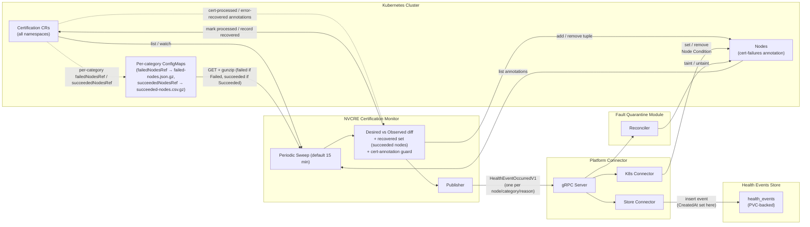

# ADR-055: Health Monitors — NVCRE Certification Monitor

## Context

The NVIDIA Cluster Readiness Engine (NVCRE, published at `github.com/NVIDIA/cluster-readiness-engine`) is a Kubernetes controller that runs GPU cluster burn-in certification tests — NCCL collectives, training workloads, DCGM diagnostics. When a category finishes, NVCRE records which nodes failed and which passed in **two per-category, gzip-compressed ConfigMaps**, referenced from the `Certification` CR at `status.categoryStatuses[].failedNodesRef` and `status.categoryStatuses[].succeededNodesRef`. The failed-nodes ConfigMap holds `failed-nodes.json.gz` (a JSON array of `{name, reason, message}` objects); the succeeded-nodes ConfigMap holds `succeeded-nodes.csv.gz`. Inline per-node lists were removed because they exceed the ~1 MiB Kubernetes object limit at thousands of nodes.

NVCRE does not own node remediation. It does not taint, cordon, or set Node conditions. Once a certification fails, the failed nodes remain schedulable and can receive new workloads unless an external system intervenes.

NVSentinel provides this remediation pipeline: health monitors detect faults, publish health events to Platform Connector, which sets Node conditions and forwards events to the Fault Quarantine Manager. The Fault Quarantine Manager applies taints, cordons, and annotations based on configurable rulesets. The Node Drainer Manager and Fault Remediation Manager handle subsequent drain and repair steps.

**Gap: there is no health monitor that watches NVCRE Certification CRs and feeds certification failures into this pipeline. Without it, operators must manually quarantine nodes after a failed certification.**

## Decision

Implement a dedicated `nvcre-certification-monitor` health monitor that:

1. Lists `nvcre.nvidia.com/v1alpha1` `Certification` CRs across all namespaces on a periodic interval (default 15 minutes, first sweep at startup) and performs a full **sweep** that rebuilds the set of failed nodes from all Certification CRs.
2. Persists per-node state as a single **node annotation** (`nvsentinel.dgxc.nvidia.com/nvcre-cert-failures-details`) holding the failures currently being held on that node.
3. Decides what to publish by diffing the **desired** set (failures derived from Certification CRs) against the **observed** set (failures recorded in node annotations), and uses two **annotations on the Certification CR itself** (`cert-processed` and `error-recovered`) as a restart-safe discriminator to distinguish a genuinely new failure from one that has already been recovered.
4. Publishes per-node, per-`(category, reason)` `HealthEventOccurredV1` events to Platform Connector via gRPC.
5. Uses a taint-only fault-quarantine ruleset (no cordon) — failed nodes are tainted to allow scheduling of certification workflow on rerun of certification.
6. **Reads failed/passed nodes from per-category ConfigMaps by status.** Each category references two gzip-compressed ConfigMaps — `status.categoryStatuses[].failedNodesRef` and `status.categoryStatuses[].succeededNodesRef`. The monitor reads **per category status**: for a `Failed` category it reads only `failedNodesRef` (gunzip `failed-nodes.json.gz`) to build the **desired** failure set (node + reason + message); for a `Succeeded` category it reads only `succeededNodesRef` (gunzip `succeeded-nodes.csv.gz`) to build the **recovered** set used to clear stale failure holds on rerun.

The deduplication unit is the tuple `(node, variant, reason)`. The first Certification CR (by completion time — the `lastTransitionTime` of its terminal condition) that produces a given tuple owns it; later certs reporting the same tuple are deduplicated. The category `domain` is not part of the identity — `variant` (e.g. `nccl-all-gather`, `nemotron5-8b`) is assumed to uniquely identify the test category.

## Implementation

### Module location

- Code: `health-monitors/nvcre-certification-monitor/`
- Helm subchart: `distros/kubernetes/nvsentinel/charts/nvcre-certification-monitor/`
- Enable via: `global.nvcreCertificationMonitor.enabled: true` in the NVSentinel umbrella chart

### Architecture



### Source resource

`nvcre.nvidia.com/v1alpha1` `Certification` (namespaced), listed across all namespaces since Certification CRs can exist in user-defined namespaces with timestamp-generated names (e.g. `xcalctl-20260528-141227`).

The monitor is sweep-only: there is no controller-runtime watch or other event-driven trigger on `Certification`. A periodic full **sweep** (default every 15 minutes via `--resync-interval` / the chart's `resyncInterval`, with the first sweep at startup) lists all Certification CRs and all annotated nodes and reconciles them together. This makes the decision logic stateless and restart-safe — the monitor holds no authoritative in-memory state; every sweep recomputes from the cluster. Detection latency is bounded by the sweep interval.

The NVCRE CRD does not have to be installed before the monitor starts. Certifications are listed through the manager's cache, whose informer starts on first use, so a missing CRD does not stop the manager: the pod stays `Running`, each sweep logs `Failed to list Certification CRs` and does nothing else, and once the CRD is installed the next sweep succeeds without a restart. The Tilt environment installs only the CRD, not the NVCRE controller; the e2e test in `tests/nvcre_certification_monitor_test.go` writes Certification status directly.

### Certification CR contract

The monitor reads from `status.categoryStatuses[]`. Each category carries **two** ConfigMap references (both `TypedLocalObjectReference`, both in the Certification's own namespace):

- `failedNodesRef` → the failed-nodes ConfigMap, whose `binaryData["failed-nodes.json.gz"]` is gzip of a **JSON array**, one object per failed node: `{"name": …, "reason": …, "message": …}`.
- `succeededNodesRef` → the succeeded-nodes ConfigMap, whose `binaryData["succeeded-nodes.csv.gz"]` is gzip of a **single comma-joined line** of passed node names.

**Which ref the monitor reads is decided by the category `status`:** for a `Failed` category it reads **only** `failedNodesRef`; for a `Succeeded` category it reads **only** `succeededNodesRef`. A `Failed` category may still carry a `succeededNodesRef` (nodes that passed within an overall-failed category), but the monitor ignores it — partial passes inside a failed category are not used for recovery; only a fully `Succeeded` category contributes to the recovered set. Either ref may be nil. A node has a single failure reason per category; the same node can appear in different categories with different reasons, but within a single category each node appears at most once.

A failed-node row carries:

- `name` — Kubernetes node name
- `reason` — one of `HardwareFailureDetected`, `ThresholdViolation`, `WorkloadFailed`
- `message` — human-readable diagnostic from NVCRE (e.g. `Workload TrainJob/test-nccl-all-gather was deleted`)

```yaml
status:
  conditions:
    - type: Failed
      status: "True"
  categoryStatuses:
    - domain: communication
      variant: nccl-all-gather
      status: Failed # → monitor reads failedNodesRef only
      workflowRef:
        name: test-nccl-all-gather-comm-f8058
        namespace: xcalctl-20260608-111029
      failedNodesRef:
        kind: ConfigMap
        name: failed-nodes-5f59c00f
      succeededNodesRef: # present (partial passes) but ignored for a Failed category
        kind: ConfigMap
        name: succeeded-nodes-5f59c00f
    - domain: communication
      variant: nccl-all-reduce
      status: Succeeded # → monitor reads succeededNodesRef only
      workflowRef:
        name: test-nccl-all-gather-comm-ca184
        namespace: xcalctl-20260608-111029
      succeededNodesRef:
        kind: ConfigMap
        name: succeeded-nodes-8d8f4685
```

The referenced ConfigMaps (same namespace), decompressed:

```text
# failed-nodes-5f59c00f  (read for the Failed nccl-all-gather category)
binaryData["failed-nodes.json.gz"] = gzip([
  {"name":"10.0.3.195","reason":"WorkloadFailed","message":"Workload TrainJob/test-nccl-all-gather-comm-f80-112be-workload was deleted"},
  {"name":"10.0.4.53","reason":"WorkloadFailed","message":"Workload TrainJob/test-nccl-all-gather-comm-f80-3b702-workload was deleted"}
])

# succeeded-nodes-8d8f4685  (read for the Succeeded nccl-all-reduce category)
binaryData["succeeded-nodes.csv.gz"] = gzip(10.0.3.195,10.0.4.53)
```

A Certification is considered terminal and failed when:

- `conditions` contains `type=Failed, status=True`
- At least one `Failed` category's `failed-nodes.json.gz` (via `failedNodesRef`) is non-empty

A category is considered terminal and passed when `status=Succeeded`; its `succeededNodesRef` ConfigMap holds the passed-node list under `succeeded-nodes.csv.gz`.

`Certification.spec` is immutable (CRD validation rule `self == oldSelf`), so a certification cannot be re-run by editing an existing CR. A re-run is always a new CR, normally in a fresh namespace, and is a new owner from the monitor's point of view: it carries no `cert-processed` annotation and its failed tuples are evaluated on their own. FCFS ownership (scenario 3) still applies if an identical tuple is already held by an older CR that is still present.

### Reading node results

For each category the monitor resolves the ref **selected by the category `status`** and reads that ConfigMap from the **Certification's own namespace**:

1. If the category is `Failed`, take `failedNodesRef`; if `Succeeded`, take `succeededNodesRef`. A **nil** ref (or a category still `InProgress`) means no relevant node detail is available — skip it.
2. `Get` the referenced ConfigMap in the Certification's namespace.
3. **Failed category** — decode via the monitor's own `nvcre.DecodeFailedNodes`, which gunzips `binaryData["failed-nodes.json.gz"]` and unmarshals the JSON array into `[]FailedNode`.
4. **Succeeded category** — gunzip `binaryData["succeeded-nodes.csv.gz"]` and split on `,` → passed node names. Node names are DNS-1123 subdomains and never contain a comma, so no escaping is needed. The monitor's `nvcre.DecodeSucceededNodes` mirrors NVCRE's unexported `mergeSucceededNodesCSV` and must track it.

Both ConfigMaps are written by NVCRE on category completion and gzip-compressed (~93% smaller) to stay well under the ConfigMap/etcd ~1 MiB limit at thousands of nodes. The monitor reads them with a live GET (not from a cache) and distinguishes three failure modes:

- **API error** (timeout, 5xx, forbidden) — the sweep aborts. Nothing is published or healed on a partial view; the next sweep retries.
- **Unreadable failed-nodes ConfigMap** (bad gzip or JSON) — the sweep aborts as well. NVCRE writes each result ConfigMap in a single update, so unreadable content is corruption or tampering rather than a transient state; treating it as empty would heal every hold the category asserts. An unreadable succeeded-nodes ConfigMap contributes nothing (no recovery), which errs toward keeping holds in place.
- **NotFound** — treated as "no entries" for that category. NVCRE creates the ConfigMap before it publishes the reference, and the ConfigMap is owned by the Workflow, which is owned by the Certification and deleted only by the Certification's own finalizer. A referenced ConfigMap can therefore be missing only because it was deleted by hand or its namespace is being deleted. In both cases the category asserts nothing and its tuples heal exactly as if the Certification had been deleted, which is the documented way to release a hold; a re-run re-asserts any node that still fails. Holding instead would stall the monitor whenever a namespace is deleted while NVCRE is unavailable (certs stuck `Terminating` with their ConfigMaps already gone).

A Certification that is `InProgress` does not trigger unhealthy events. Only terminal (`Failed=True`) certs contribute failures to the desired set.

### Policy-based event filtering

The monitor uses a configurable policy to determine which failure reasons trigger health events. Only failed-node rows (parsed from each category's `failed-nodes.json.gz`) that match a configured policy's CEL expression enter the desired set (and thus get published and annotated). Rows that don't match any policy are ignored entirely — no health event, no annotation tuple, no Node Condition.

**Default policy** (Helm-configurable):

```yaml
# values.yaml
policies:
  - name: certification-failures
    match: "(failedNode.reason == 'ThresholdViolation') || (failedNode.reason == 'WorkloadFailed')"
```

Each policy has a `match` field containing a CEL expression evaluated against every `(category, failedNode)` row read from a failed Certification's `failed-nodes.json.gz`. If the expression returns true, the row enters the desired set. The `errorCode` is derived internally from the category and reason. The `failedNode.*` CEL variables map to the JSON fields (`name`, `reason`, `message`).

`HardwareFailureDetected` is not matched by the default policy. This is intentional — `HardwareFailureDetected` is a pass-through of external node state (NVCRE's CEL health check detects that a node was already cordoned by another system). The node is already quarantined by the original health monitor (e.g. gpu-health-monitor of NVSentinel). Publishing a second health event creates complex lifecycle issues. Operators can include it by setting `match: "true"` or appending `|| (failedNode.reason == 'HardwareFailureDetected')`. Such a tuple then follows the same lifecycle as any other: it is released when a newer run of that category passes the node, when the Certification is deleted, or when an operator removes the tuple from the node annotation. It does not follow the original quarantine — the hold stays after the health monitor that first cordoned the node heals it, until one of those three things happens.

### State model: the node annotation

State is persisted as a single annotation on each affected node:

- **Annotation key**: `nvsentinel.dgxc.nvidia.com/nvcre-cert-failures-details`
- **Annotation value**: a JSON array of `<variant>/<reason>` keys — just the set of tuples currently held on this node. The node identity is implicit (the annotation is on the node), so the full tuple is `(node, variant, reason)`.

```yaml
# On node gpu-01
metadata:
  annotations:
    nvsentinel.dgxc.nvidia.com/nvcre-cert-failures-details: |
      [
        "nccl-all-gather/ThresholdViolation",
        "nemotron5-8b/WorkloadFailed"
      ]
```

The annotation is updated with `retry.RetryOnConflict` (the same pattern as the existing kubernetes-object-monitor annotation manager). When the last tuple for a node is removed, the annotation key is deleted.

The annotation serves three roles:

1. **Observed set** — the source of truth for "what failures the monitor is currently holding on this node," used in the desired-vs-observed diff.
2. **Operator-visible record** — `kubectl describe node` (or a label-selector list of annotated nodes) shows exactly which certification failures hold a node.
3. **Operator remediation surface** — an operator can remove a tuple (or the whole annotation) to signal "clear this hold" without deleting/re-run the Certification (see the heal logic below).

There is **no in-memory authoritative state**. The monitor may cache the last sweep result for diffing convenience, but correctness never depends on it: each sweep recomputes desired (from certs), observed (from node annotations), and the discriminator (from the Certification CR's own annotations).

### State model: the Certification annotations

Two further annotations are written on the **Certification CR** and together form the restart-safe discriminator:

- **`nvsentinel.dgxc.nvidia.com/cert-processed`** — set to the cert's terminal `lastTransitionTime` (RFC 3339) once the monitor has published at least one unhealthy event for that terminal state; a legacy value of `"true"` is still accepted. It answers "have I already acted on this cert in its current terminal state?" A cert that NVCRE reopens and re-fails gets a new terminal time, so its stale stamp no longer matches and its previously released tuples count as new failures again.
- **`nvsentinel.dgxc.nvidia.com/error-recovered`** — a JSON array of `"<node>#<variant>/<reason>"` keys that have been released for that cert. It answers "which of this cert's tuples must never be re-published?"

Because both live on the cert rather than in memory, the monitor reaches the same decision after a restart, and no external store is consulted.

### The reconcile sweep

Every sweep (default 15 minutes):

1. **Build `desired` (ordered fold).** List all Certification CRs in all namespaces, keep those in a terminal state (`Failed=True` or `Succeeded=True`), and sort them ascending by completion time — the `lastTransitionTime` of that terminal condition. Fold the certs in that order:
   - For each `Failed` category resolve `failedNodesRef`, GET the ConfigMap in the cert's namespace, gunzip `failed-nodes.json.gz`, and decode each `{name, reason, message}` entry. For each entry matching a policy, emit the tuple `(node, variant, reason)` — unless the owning cert's `error-recovered` annotation already lists that tuple, in which case it is skipped outright. **FCFS dedup:** if the tuple already exists in `desired` (from an earlier cert), keep the earlier cert's entry and append the later cert as a contributor.
   - For each `Succeeded` category resolve `succeededNodesRef`, GET the ConfigMap, gunzip `succeeded-nodes.csv.gz`, and for every passed node **delete every `(node, variant, *)` tuple currently in `desired`**, regardless of `reason` — a passed node covers the whole `variant`. (A `Failed` category's `succeededNodesRef` is **not** read — partial passes do not contribute. A missing or unreadable succeeded-nodes ConfigMap contributes nothing.)

   Because the fold runs in completion order, a pass only clears failures asserted by certs that completed *before* it: the node was re-tested for that category by a newer run and passed, so the older failure no longer holds. A failure asserted by a cert that completed *after* the pass is re-added and stays in `desired`, owned by that later cert alone (A fails at T1, C passes at T2, B fails at T3 → A adds the tuple, C removes it, B re-adds it). Tuples cleared this way fall through to the "observed but not desired" heal path (step 3), which publishes a healthy event and removes the annotation. Per tuple the sweep records, in-memory only, the failure `message` and the set of contributing certs — the message populates the published event (and thus the Node Condition). Neither is persisted in the node annotation, so nothing becomes stale.
2. **Build `observed`.** List all nodes; parse the `nvsentinel.dgxc.nvidia.com/nvcre-cert-failures-details` annotation; emit every `(node, variant, reason)` tuple it contains. A node whose annotation is present but cannot be parsed is skipped and the parse error is logged at error level: it contributes no tuples and every desired tuple for it is left undecided, so nothing is published for that node and any cert asserting a tuple on it is not marked processed; the value is left in place for an operator to repair and the sweep continues with the other nodes.
3. **Reconcile each tuple** (see decision tables below).

**Decision table — tuple in `desired`:**

| `desired` | `observed` (node annotation) | Owning cert's annotations         | Action                                                                                                          | When it arises                                                                                                                                                                 |
| --------- | ---------------------------- | --------------------------------- | --------------------------------------------------------------------------------------------------------------- | ------------------------------------------------------------------------------------------------------------------------------------------------------------------------------ |
| yes       | yes                          | (any)                             | No-op — hold already active.                                                                                    | Steady state: a failure already published and annotated, cert still `Failed=True`. The common case on every sweep after the first.                                             |
| yes       | no                           | `cert-processed` absent           | **New failure** → publish unhealthy, write node annotation tuple, mark the contributing certs `cert-processed`. | First time the monitor acts on this cert's failure — including a brand-new cert that fails a node recovered under an older cert (see #7), since the discriminator is per-cert. |
| yes       | no                           | `cert-processed` present          | **Operator removed the annotation** → publish healthy and add the tuple to the cert's `error-recovered`.        | The monitor already published for this cert, so the missing node tuple means an operator cleared the hold by hand (#6).                                                        |
| (skipped) | —                            | tuple listed in `error-recovered` | Never re-enters `desired` (anti-flap).                                                                          | Once released, a lingering `Failed=True` cert cannot resurrect the same tuple. This is enforced while building `desired`, not during reconcile.                                |

**Decision table — tuple in `observed` but not `desired`:**

| `desired` | `observed` | Cause                                                                                    | Action                                                                   |
| --------- | ---------- | ---------------------------------------------------------------------------------------- | ------------------------------------------------------------------------ |
| no        | yes        | the owning cert was **deleted**                                                          | publish healthy + remove annotation tuple.                               |
| no        | yes        | the tuple was **cleared by a newer passing run** (a `Succeeded` category that completed after the failing cert passed this `(node, variant)`) | publish healthy + remove annotation tuple (rerun recovery — see #9/#10). |

Both causes collapse to the same action: the hold is no longer desired, so it is released. The monitor does not need to distinguish them; identity comes from the annotation, and the heal is idempotent.

The **cert-annotation discriminator** is what makes the "desired-but-not-observed" branch correct and restart-safe, and it replaces an earlier design that queried the health-events store on every sweep. Keeping the discriminator on the Certification CR removes the monitor's read dependency on the store and makes each decision reproducible from cluster state alone:

- **`cert-processed` absent** → the monitor has not yet acted on this cert → genuine new failure → publish unhealthy.
- **`cert-processed` present, node tuple missing** → the monitor published earlier and the tuple has since been removed by an operator → publish healthy and record the tuple in `error-recovered`.
- **Tuple in `error-recovered`** → already released → filtered out while building `desired`, so it never re-flaps even while the cert stays `Failed=True`.

### Health event design

For each tuple, the monitor publishes one health event:

| Health event field   | Value                                                                    |
| -------------------- | ------------------------------------------------------------------------ |
| `agent`              | `nvcre-certification-monitor`                                            |
| `checkName`          | `NVCRECertFailed`                                                        |
| `componentClass`     | `Node`                                                                   |
| `isFatal`            | `true`                                                                   |
| `nodeName`           | the failed node name                                                     |
| `recommendedAction`  | `CONTACT_SUPPORT`                                                        |
| `errorCode`          | `["<variant>/<reason>"]` — stable, cert-independent                      |
| `entitiesImpacted`   | `[{entityType: "v1/Node", entityValue: "<nodeName>"}]`                   |
| `message`            | the `message` from the owning cert's entry (FCFS), or the fallback below |
| `processingStrategy` | `EXECUTE_REMEDIATION` (Helm-overridable)                                 |

#### Why `errorCode` must include the `variant` (not just `reason`)

The `errorCode` must carry the `variant`, not just the `reason`. Platform Connector collapses all of a node's cert failures into a single Node Condition whose `Type` is the `checkName` (`NVCRECertFailed`); individual failures live as separate messages inside that one condition, each tagged with its `ErrorCode:` token and the impacted entity. Because the monitor's only impacted entity is the node itself (`v1/Node:<nodeName>`, identical for every cert failure on that node), the `errorCode` is the sole discriminator between messages — and a healthy event clears a message only when both the entity and the `errorCode` match.

Worked example — `gpu-01` fails both `nccl-all-gather/WorkloadFailed` and `nemotron5-8b/WorkloadFailed`:

- **With `<variant>/<reason>`:** the messages carry `ErrorCode:nccl-all-gather/WorkloadFailed` and `ErrorCode:nemotron5-8b/WorkloadFailed` → two distinct, independently-clearable messages.
- **With `reason` only:** both carry `ErrorCode:WorkloadFailed` on the same node entity. When category A heals (its cert is deleted) and the monitor publishes a healthy event with `errorCode=WorkloadFailed`, `removeImpactedEntitiesMessagesScoped` matches both messages (same entity + same errorCode) and wipes category B's message too — even though B is still failing. A false recovery, and the taint-hold accounting (also keyed by `(node, errorCode)`) over-releases the same way.

### Fault Quarantine ruleset configuration

Monitor health events are processed by Fault Quarantine using a dedicated ruleset that only applies a taint — no cordon. NVCRE reports a cordoned node as `HardwareFailureDetected` and skips it, so a cordoned node could never be re-certified. A dedicated taint keeps ordinary workloads off the failed node while certification pods tolerate it and can rerun there.

```toml
# Fault Quarantine ruleset for nvcre-certification-monitor events
[[rulesets]]
  name = "nvcre-cert-failure"
  [rulesets.match]
    agent = "nvcre-certification-monitor"
    checkName = "NVCRECertFailed"
  [rulesets.cordon]
    shouldCordon = false
  [rulesets.taint]
    key = "nvsentinel.dgxc.nvidia.com/nvcre-cert-failed"
    value = "true"
    effect = "NoSchedule"
```

When the monitor publishes a healthy event, Fault Quarantine removes the taint hold for that `(node, errorCode)`. Since `shouldCordon = false`, Fault Quarantine never cordons/uncordons — it only manages the taint lifecycle.

### Edge cases and scenarios

#### 1. Single category, single node

```text
# category communication/nccl-all-gather (Failed), failedNodesRef → cm "failed-nodes-…"
failed-nodes.json.gz = gzip([{"name":"gpu-01","reason":"ThresholdViolation","message":"AllGather bandwidth below threshold"}])
```

`desired` gains `(gpu-01, nccl-all-gather, ThresholdViolation)`; not in `observed`; no prior healthy event → publish 1 unhealthy event and write the annotation tuple. Platform Connector sets 1 Node Condition message; Fault Quarantine applies the taint (no cordon).

#### 2. Same node, multiple categories

```text
# category communication/nccl-all-gather
failed-nodes.json.gz = gzip([{"name":"gpu-01","reason":"ThresholdViolation",…}])
# category training/nemotron5-8b
failed-nodes.json.gz = gzip([{"name":"gpu-01","reason":"WorkloadFailed",…}])
```

Two tuples on gpu-01 (from two categories' ConfigMaps) → two annotation entries, two health events (distinct `errorCode`) published, two independent taint holds, two Node Condition messages. Removing one annotation entry heals only that tuple; the other hold keeps the taint.

#### 3. Same `(node, category, reason)` across multiple certs

cert-A (completion time T1) and cert-B (T2 > T1), in any namespaces, both report `gpu-01 / communication-nccl / ThresholdViolation`.

- Because `desired` is built in completion-time order of the certification CRs, cert-A (the earlier one) owns the tuple. The monitor publishes one unhealthy event, and records the tuple key in the annotation. Cert-B produces the same tuple, so it is deduplicated — no second event is published.
- If cert-A is later deleted while cert-B still reports the failure: the tuple is still in `desired` (cert-B sustains it), so the hold is not healed and remains correct.

#### 4. Same `(node, category)`, different reason across certs

cert-A: `gpu-01 / communication-nccl / ThresholdViolation`; cert-B: `gpu-01 / communication-nccl / WorkloadFailed`. These are **different tuples** (reason differs) → two annotation entries, two `errorCode`s, two independent holds.

#### 5. Certification CR deleted

The cert's tuples vanish from `desired` unless another terminal cert still asserts them (scenario 3), but remain in `observed` (annotation). For each tuple with no remaining contributor the monitor publishes a healthy event and removes the annotation entry; a tuple another Failed cert still reports stays held. Platform Connector removes the matching Node Condition message; Fault Quarantine removes the taint hold. No Certification CR read is needed — identity comes from the annotation. Restart-safe: if the monitor was down when the cert was deleted, the next sweep still sees annotation-present + cert-absent and heals.

#### 6. Operator removes / edits the annotation

An operator removes a tuple from a node's `cert-failures` annotation while the owning cert is still `Failed=True`.

- Next sweep: tuple is in `desired` (cert still present) but not in `observed` (operator removed it), and the owning cert already carries `cert-processed` → the monitor interprets this as an operator-initiated clear → publishes a **healthy** event and appends the tuple to the cert's `error-recovered` annotation. Fault Quarantine removes the taint; Platform Connector removes the Node Condition message.
- Subsequent sweeps: the tuple is filtered out while building `desired` because it is listed in `error-recovered` → suppressed (anti-flap). The hold does not come back even though the cert is still `Failed`.

#### 7. New certification fails after a recovery

A brand-new cert (completion time T3) fails the same node/category/reason that was previously recovered at T2 (T3 > T2). The tuple is in `desired` and not in `observed`. The discriminator is per-cert: the new cert carries neither `cert-processed` nor an `error-recovered` entry for the tuple, because the older cert's `error-recovered` list only suppresses that older cert's own contribution. The tuple therefore re-enters `desired` owned by the new cert and is classified as a genuine new failure → publish unhealthy. No query against the health-events store is involved — the decision follows entirely from the annotations on the Certification CRs.

#### 8. Pod restart

The monitor holds no authoritative in-memory state. On restart it simply resumes sweeping: `desired` from certs, `observed` from node annotations, discriminator from the Certification annotations. Any of #5–#8 that occurred while it was down are reconciled on the first sweep.

#### 9. Re-run certification succeeds (auto-recovery)

An operator re-runs a certification; the new cert (completion time T3) passes on the previously-failed node held by an old `Failed=True` cert (T1 < T3). The new cert's `Succeeded` category sets `succeededNodesRef`; the sweep reads that ConfigMap, gunzips it, and finds the node in the passed set for that `variant`. Because the fold processes the T1 failure before the T3 pass, the pass removes `(node, variant, reason)` from `desired` even though the old cert still reports it. The tuple is now `observed`-but-not-`desired` → the monitor publishes a **healthy** event and removes the annotation tuple. Fault Quarantine removes the taint; Platform Connector removes the Node Condition. The node recovers automatically without deleting the old cert or editing annotations.

This works across namespaces and names: the link is `(node, variant)` + timestamp ordering, not the cert name or namespace. A rerun that passes a node a newer NVCRE run actually tested is authoritative — NVCRE only writes the ConfigMap when that category's Workflow fully succeeds.

#### 10. Partial rerun

A new cert passes some categories and fails others. For its **`Failed`** categories the monitor reads `failedNodesRef` and publishes unhealthy for its own tuples (normal path). For its **`Succeeded`** categories it reads `succeededNodesRef`, so the sweep adds those `(node, variant)` to `recovered` and auto-clears any older held tuples for exactly those categories (#9), while leaving holds for still-failing categories untouched.

#### 11. Manual untaint of a node tainted by the monitor

An operator manually removes the `nvsentinel.dgxc.nvidia.com/nvcre-cert-failed` taint.

1. Fault Quarantine detects the manual untaint → removes quarantine annotations, cancels breakfix, sets `quarantinedNodeUntaintedManually`.
2. The node can accept new workloads.
3. The monitor does not auto-publish healthy. The `cert-failures` annotation and the Node Condition remain as a record of the failure.
4. To fully clear the state, the operator removes the annotation tuple (#6) or deletes the cert (#5).

#### 12. Message fallback

The CR `message` is optional. When empty, the monitor publishes a constructed message:

```text
certification failure has occurred on this node, investigate the cause
```

#### 13. Node deleted

If a node carrying the annotation is deleted, its tuples disappear from `observed` on the next sweep (the node is gone) while they stay in `desired` for as long as the owning Certification CR exists. Because that CR is already marked `cert-processed`, the monitor handles this exactly like scenario 6: it publishes a healthy event for the tuple's `errorCode` and records `<node>#<variant>/<reason>` in the CR's `error-recovered` annotation. Re-adding the annotation is skipped because the node no longer exists (`Node not found, must have been deleted`). The healthy event has no node to heal and is simply persisted downstream. Once the CR is deleted the tuple leaves `desired` as well and nothing further happens.

### RBAC requirements

```yaml
# ClusterRole
- apiGroups: ["nvcre.nvidia.com"]
  resources: ["certifications"]
  verbs: ["get", "list", "watch", "patch"] # patch: cert-processed / error-recovered annotations
- apiGroups: [""]
  resources: ["nodes"]
  verbs: ["get", "list", "watch", "patch"] # patch: cert-failures annotation and label
- apiGroups: [""]
  resources: ["configmaps"]
  verbs: ["get"] # read-only, fetched directly (not cached): per-category failedNodesRef / succeededNodesRef ConfigMaps
```

The monitor needs `patch` on `certifications` to maintain the `cert-processed` and `error-recovered` annotations. It has no dependency on the health-events store.
It needs read-only access to ConfigMaps to resolve `failedNodesRef` / `succeededNodesRef` and read the per-category `failed-nodes.json.gz` / `succeeded-nodes.csv.gz` lists.
