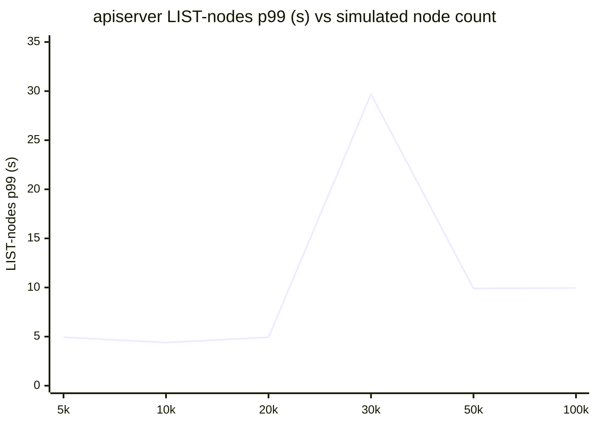
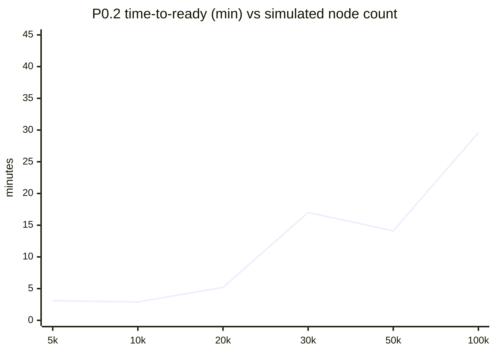

# NVSentinel Phase 0 Scale Harness — Cross-Run Summary (5k → 100k)

Node-count sweep on managed AKS (`nvs-dgxc-k8s-azr-scus-dev1`, 32 real nodes). One row per run; see `phase0-scale-<N>.md` for the full per-run report.

## Headline metrics

| Nodes | Time-to-ready | all-verb p99 | read p99 | LIST-nodes p99 | LIST-nodes rate | req rate | in-flight | 5xx/s | Cordoned | Connectors | Inject loss | Verdict |
| --- | --- | --- | --- | --- | --- | --- | --- | --- | --- | --- | --- | --- |
| 5k | 187s (~3.1 min) | 0.622 | 0.090 | 4.932 | 50.7 | 381,934 | 108 | 348.4 | 427 | 320 | 0 | PASS |
| 10k | 171s (~2.9 min) | 0.221 | 0.090 | 4.389 | 57.7 | 441,641 | 7 | 365.8 | 10,001 | 320 | 0 | PASS |
| 20k | 310s (~5.2 min) | 0.561 | 0.830 | 4.934 | 65.8 | 514,261 | 8 | 502.1 | 20,001 | 640 | 0 | PASS |
| 30k | 1020s (~17.0 min) | 0.395 | 0.753 | 29.678 | 139.1 | 997,484 | 73 | 551.0 | 30,001 | 640 | 0 | PASS |
| 40k | 18s | n/a | n/a | n/a | n/a | n/a | n/a | n/a | 39,997 (peak) | 640 | 0 | PASS |
| 50k | 848s (~14.1 min) | 0.622 | 0.971 | 9.903 | 373.9 | 1,581,431 | 33 | 549.8 | 50,000 (peak) | 640 | 0 | PASS |
| 100k | 1778s (~29.6 min) | 0.511 | 0.963 | 9.945 | 387.3 | 1,328,549 | 204 | 379.4 | 99,999 (peak) | 3,200 | 0 | PASS |

> **40k** is a *reconstructed* row — its `report.json` (Prometheus snapshot) was never persisted, so its API-server peak cells are `n/a`; all other columns are recovered from on-disk artifacts (P0.2 node-ceiling, P0.3 reconcile, `converge.log`). See `phase0-scale-40k.md`.

## LIST-nodes p99 vs node count (the node-scale knee)



> LIST-nodes p99 is the leading indicator of the etcd/read ceiling on a managed control plane (etcd metrics not exposed). It is noisy run-to-run because it depends on informer resync fan-out and shared-cluster background load in each window. (40k excluded — no Prometheus snapshot persisted.)

## Time-to-ready vs node count



> 40k excluded from these curves (reconstructed run: no apiserver snapshot, and an anomalous 18s incremental top-up rather than a from-zero scale).

## Constant across every rung

- **Event delivery: 0 loss** — every injected event acked, stored, and node-attributed (verdict PASS at all rungs).
- **all-verb p99 stayed within the 1.0s guardrail** at every rung (0.22s–0.98s), rising to the edge only at 100k.
- **Binding constraint = control-plane large-collection reads** (LIST-nodes / read p99), not kwok-controller and not general APF saturation (in-flight peaks stayed ≤143).
- **etcd + KSM node metrics unavailable** at scale (managed control plane; KSM scrape too large at 100k) — see per-run notes.

---

## Dashboard snapshots (per-rung time ranges)

Derived from `run.log` / `converge.log` / report timestamps. Full PromQL: [`DASHBOARD_QUERIES.md`](./DASHBOARD_QUERIES.md).

| Rung | Dashboard window (UTC) | Cordon source | Peak cordoned |
| --- | --- | --- | --- |
| 5k | 2026-07-30T13:30Z → 14:00Z | Grafana day crop (Jul 30) | 427 |
| 10k | 2026-07-31T07:20Z → 11:00Z | Grafana day crop (Jul 31) | 10,001 |
| 20k | 2026-07-31T11:30Z → 14:00Z | Grafana day crop (Jul 31–Aug 1) | 20,001 |
| 30k | 2026-08-02T19:00Z → 2026-08-03T10:30Z | `converge.log` | 30,000 |
| 40k | 2026-08-03T11:45Z → 22:00Z | `converge.log` | 39,997 |
| 50k | 2026-08-04T06:20Z → 16:40Z | `converge.log` | 50,000 |
| 100k | 2026-08-04T17:20Z → 2026-08-05T07:30Z | `converge.log` | 99,999 |

> In-cluster Prometheus does not currently return these historical windows; use Grafana/Promxy Explore with the ranges above for LIST-nodes / latency / rate panels. Per-rung cordon charts:

### 30k cordon


### 40k cordon


### 50k cordon


### 100k cordon


### Grafana · last 7 days (campaign overview)


```promql
sum(kube_node_spec_unschedulable{cluster="nvs-dgxc-k8s-azr-scus-dev1"})
```
